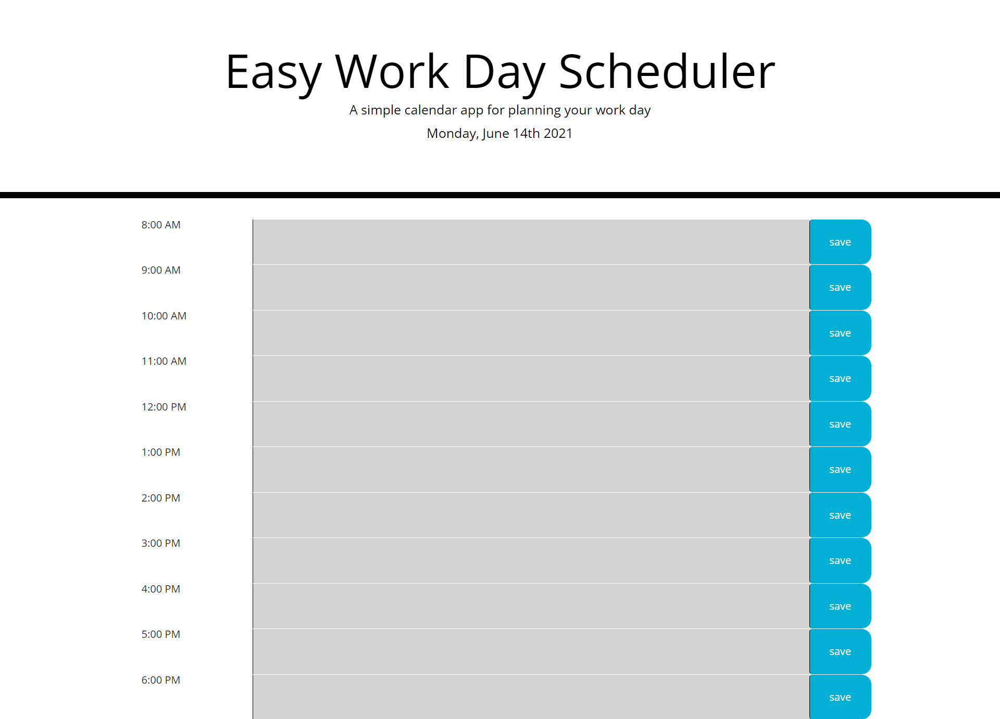

# Work Day Scheduling, Made Easy

# Why, What and How is it?

## Why?
At-A-Glance information. Simple click interface. We need to simplify our lives and one of the easiest ways to accomplish that goal is to take our schedules out of our heads and put them down on our screens.

## What?
This release shows you your work day by hour and allows you to add notes or specific appointment data in the hourly blocks. When you have noted what you want, you hit "save" to keep that information. (If you change your mind, delete your note and "save" the cleared field - no accidental deletions!)

## How?
Using an append statement in JavaScript, the timeblock container is loaded row-by-row, similar to the way a password might be built from several different character type selections, rather than in separate hourly code blocks. This serves to streamline and simplify the code base. Moment.js is used to grab current time information.

## What else do I need to know?
The Easy Work Day Scheduler also keeps track of the time during the day and shows different colors based on where you are during the day (past hours are grey, present is red and future are green). (The screenshot below shows grey hours because of the time of day it was taken - but, the colors really do work!) Cheers!

## Installation
Great news! Simply launch the page associated with the repo to view and use this code:

Repo:  https://github.com/dtmerrill/HW3-DTM-Password_Generator

Deployed Page:  https://dtmerrill.github.io/HW3-DTM-Password_Generator/

## Usage

Just click and type to enter text and click the blue "save" button to interface with the page.

## Credits
Some base code from my Boot Camp (Trilogy Education Services).

## License
MIT License

Copyright (c) [2021] [Dana T Merrill]

Permission is hereby granted, free of charge, to any person obtaining a copy
of this software and associated documentation files (the "Software"), to deal
in the Software without restriction, including without limitation the rights
to use, copy, modify, merge, publish, distribute, sublicense, and/or sell
copies of the Software, and to permit persons to whom the Software is
furnished to do so, subject to the following conditions:

The above copyright notice and this permission notice shall be included in all
copies or substantial portions of the Software.

THE SOFTWARE IS PROVIDED "AS IS", WITHOUT WARRANTY OF ANY KIND, EXPRESS OR
IMPLIED, INCLUDING BUT NOT LIMITED TO THE WARRANTIES OF MERCHANTABILITY,
FITNESS FOR A PARTICULAR PURPOSE AND NONINFRINGEMENT. IN NO EVENT SHALL THE
AUTHORS OR COPYRIGHT HOLDERS BE LIABLE FOR ANY CLAIM, DAMAGES OR OTHER
LIABILITY, WHETHER IN AN ACTION OF CONTRACT, TORT OR OTHERWISE, ARISING FROM,
OUT OF OR IN CONNECTION WITH THE SOFTWARE OR THE USE OR OTHER DEALINGS IN THE
SOFTWARE.